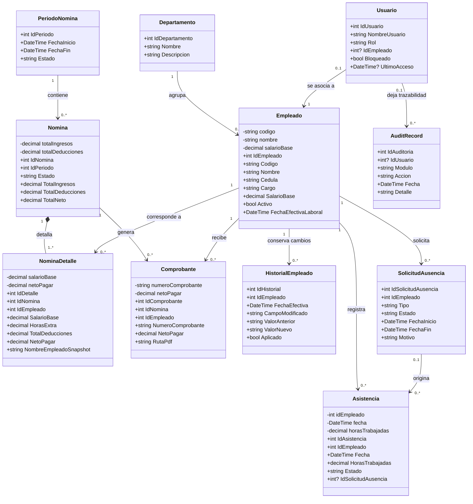
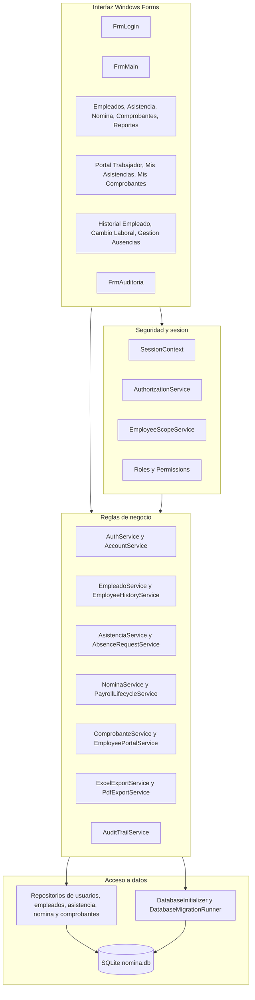
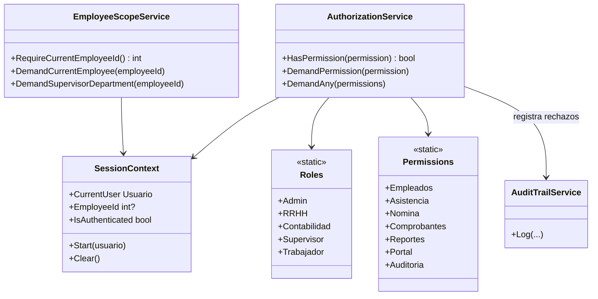

# Diagrama UML - ProyFinal_LPI_Eq01_NomiCore

Este diagrama representa las clases principales que existen en la aplicacion **NomiCore - Sistema de Gestion de Nomina**. Se priorizan las entidades del dominio, los servicios que contienen reglas de negocio, los repositorios SQLite, la seguridad y los formularios que usan el usuario.

## 1. Modelo del dominio

`Empleado`, `Asistencia`, `Nomina`, `NominaDetalle` y `Comprobante` aplican el Tema H: manejan campos privados y propiedades publicas validadas. De esta forma, los montos, codigos, fechas, estados y datos esenciales se validan antes de persistirse.

## 2. Capas de la aplicacion

## 3. Servicios y repositorios principales

```mermaid
classDiagram
    class AuthService {
        +Authenticate(username, password) AuthenticationResult
    }
    class AccountService {
        +ChangeOwnPassword(current, new, confirmation)
    }
    class EmpleadoService {
        +Save(empleado)
        +GetAll()
    }
    class EmployeeHistoryService {
        +SaveChange(context) EmployeeSaveResult
        +GetHistory(query)
    }
    class AsistenciaService {
        +Register(asistencia)
        +GetFiltered(...)
    }
    class AbsenceRequestService {
        +Create(request)
        +Approve(id, reason)
        +Reject(id, reason)
        +Cancel(id, reason)
    }
    class NominaService {
        +Calculate(periodo)
        +Confirm(idNomina)
    }
    class PayrollLifecycleService {
        +Pay(idNomina, motivo)
        +Void(idNomina, motivo)
        +Recalculate(idNomina)
    }
    class ComprobanteService {
        +GetByNomina(idNomina)
    }
    class EmployeePortalService {
        +GetDashboard()
        +GetMyProfile()
        +GetMyAttendance(...)
        +DownloadMyPayslipPdf(id)
    }
    class AuditTrailService {
        +Log(...)
    }
    class UsuarioRepository
    class EmpleadoRepository
    class AsistenciaRepository
    class NominaRepository
    class ComprobanteRepository
    class EmployeeHistoryRepository
    class AbsenceRequestRepository
    class AuditRepository
    class AuthenticationRepository

    AuthService --> AuthenticationRepository
    AccountService --> AuthenticationRepository
    EmpleadoService --> EmpleadoRepository
    EmployeeHistoryService --> EmployeeHistoryRepository
    EmployeeHistoryService --> EmpleadoRepository
    AsistenciaService --> AsistenciaRepository
    AbsenceRequestService --> AbsenceRequestRepository
    AbsenceRequestService --> AsistenciaRepository
    NominaService --> NominaRepository
    PayrollLifecycleService --> NominaRepository
    PayrollLifecycleService --> ComprobanteRepository
    ComprobanteService --> ComprobanteRepository
    EmployeePortalService --> ComprobanteRepository
    EmployeePortalService --> AsistenciaRepository
    AuditTrailService --> AuditRepository
```

## 4. Seguridad y permisos

## Notas para la sustentacion

- La interfaz no contiene SQL ni calculos de negocio: los formularios llaman servicios.
- Los servicios usan repositorios con consultas parametrizadas y SQLite como almacenamiento local.
- `SessionContext`, `AuthorizationService` y `EmployeeScopeService` protegen los modulos por rol y por alcance del empleado.
- `AuditTrailService` registra operaciones relevantes sin guardar contrasenas ni hashes.
- `ComprobantePrintRenderer`, `PdfExportService` y `PrintDocument` reutilizan la logica de presentacion de comprobantes para vista previa, impresion y PDF.
