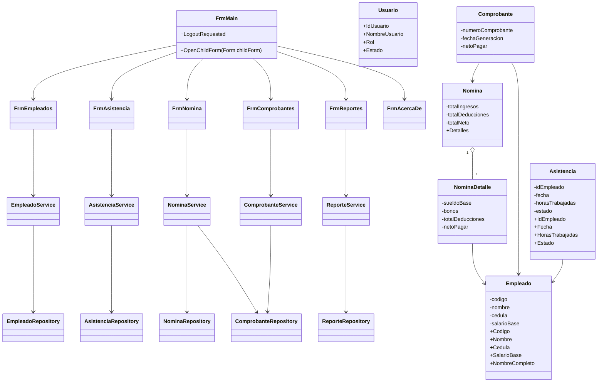

# Diagrama UML De Clases

```mermaid
classDiagram
    class FrmMain {
        +OpenChildForm(Form childForm)
        +LogoutRequested
    }

    class FrmEmpleados
    class FrmAsistencia
    class FrmNomina
    class FrmComprobantes
    class FrmReportes
    class FrmAcercaDe

    class Usuario {
        +IdUsuario
        +NombreUsuario
        +Rol
        +Estado
    }

    class Empleado {
        -codigo
        -nombre
        -cedula
        -salarioBase
        +Codigo
        +Nombre
        +Cedula
        +SalarioBase
        +NombreCompleto
    }

    class Asistencia {
        -idEmpleado
        -fecha
        -horasTrabajadas
        -estado
        +IdEmpleado
        +Fecha
        +HorasTrabajadas
        +Estado
    }

    class Nomina {
        -totalIngresos
        -totalDeducciones
        -totalNeto
        +Detalles
    }

    class NominaDetalle {
        -sueldoBase
        -bonos
        -totalDeducciones
        -netoPagar
    }

    class Comprobante {
        -numeroComprobante
        -fechaGeneracion
        -netoPagar
    }

    class EmpleadoService
    class AsistenciaService
    class NominaService
    class ComprobanteService
    class ReporteService

    class EmpleadoRepository
    class AsistenciaRepository
    class NominaRepository
    class ComprobanteRepository
    class ReporteRepository

    FrmMain --> FrmEmpleados
    FrmMain --> FrmAsistencia
    FrmMain --> FrmNomina
    FrmMain --> FrmComprobantes
    FrmMain --> FrmReportes
    FrmMain --> FrmAcercaDe

    FrmEmpleados --> EmpleadoService
    FrmAsistencia --> AsistenciaService
    FrmNomina --> NominaService
    FrmComprobantes --> ComprobanteService
    FrmReportes --> ReporteService

    Nomina "1" o-- "*" NominaDetalle
    NominaDetalle --> Empleado
    Comprobante --> Nomina
    Comprobante --> Empleado
    Asistencia --> Empleado

    EmpleadoService --> EmpleadoRepository
    AsistenciaService --> AsistenciaRepository
    NominaService --> NominaRepository
    NominaService --> ComprobanteRepository
    ComprobanteService --> ComprobanteRepository
    ReporteService --> ReporteRepository
```
