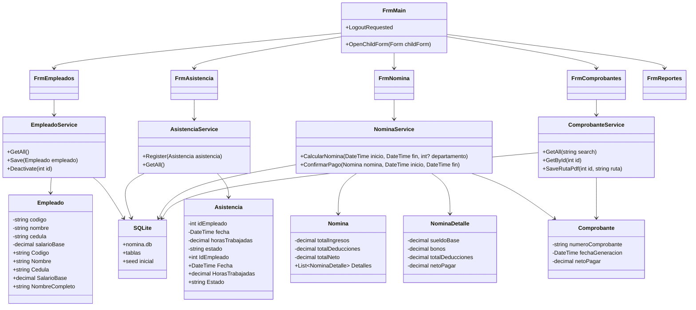

# Diagrama De Clases

```mermaid
classDiagram
    class FrmMain {
        +OpenChildForm(Form childForm)
        +LogoutRequested
    }

    class FrmEmpleados
    class FrmAsistencia
    class FrmNomina
    class FrmComprobantes
    class FrmReportes

    class Empleado {
        -string codigo
        -string nombre
        -string cedula
        -decimal salarioBase
        +string Codigo
        +string Nombre
        +string Cedula
        +decimal SalarioBase
        +string NombreCompleto
    }

    class Asistencia {
        -int idEmpleado
        -DateTime fecha
        -decimal horasTrabajadas
        -string estado
        +int IdEmpleado
        +DateTime Fecha
        +decimal HorasTrabajadas
        +string Estado
    }

    class Nomina {
        -decimal totalIngresos
        -decimal totalDeducciones
        -decimal totalNeto
        +List~NominaDetalle~ Detalles
    }

    class NominaDetalle {
        -decimal sueldoBase
        -decimal bonos
        -decimal totalDeducciones
        -decimal netoPagar
    }

    class Comprobante {
        -string numeroComprobante
        -DateTime fechaGeneracion
        -decimal netoPagar
    }

    class EmpleadoService {
        +GetAll()
        +Save(Empleado empleado)
        +Deactivate(int id)
    }

    class AsistenciaService {
        +Register(Asistencia asistencia)
        +GetAll()
    }

    class NominaService {
        +CalcularNomina(DateTime inicio, DateTime fin, int? departamento)
        +ConfirmarPago(Nomina nomina, DateTime inicio, DateTime fin)
    }

    class ComprobanteService {
        +GetAll(string search)
        +GetById(int id)
        +SaveRutaPdf(int id, string ruta)
    }

    class SQLite {
        +nomina.db
        +tablas
        +seed inicial
    }

    FrmMain --> FrmEmpleados
    FrmMain --> FrmAsistencia
    FrmMain --> FrmNomina
    FrmMain --> FrmComprobantes
    FrmMain --> FrmReportes

    FrmEmpleados --> EmpleadoService
    FrmAsistencia --> AsistenciaService
    FrmNomina --> NominaService
    FrmComprobantes --> ComprobanteService

    EmpleadoService --> Empleado
    AsistenciaService --> Asistencia
    NominaService --> Nomina
    NominaService --> NominaDetalle
    NominaService --> Comprobante
    ComprobanteService --> Comprobante

    EmpleadoService --> SQLite
    AsistenciaService --> SQLite
    NominaService --> SQLite
    ComprobanteService --> SQLite
```
